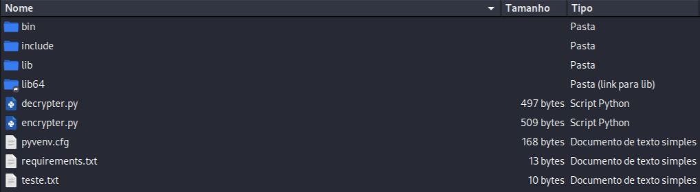

# Ransomware desenvolvido em Python

### Ferramentas

- Python version 3.12.8
- Lib ```pyaes``` version 1.6.1

### Funcionamento
- Executado o comando ```python3 -m venv py ``` para criar o ambiente de desenvolvimento do script
- Executado o comando ```pip3 freeze > requirements.txt``` para gerar o arquivos com as dependências do script

Ao executar o arquivo ``` encrypter.py ```, o script:
- Lê o conteúdo do arquivo ``` teste.txt ``` e o armazena na variável ```file_data```
- Remove o arquivo ``` teste.txt ```
- Criptografa o conteúdo da variável ```file_data``` com a chave ``` testeransomwares ```
- Salva o conteúdo criptografado em um novo arquivo com o nome de ``` teste.txt.ransomwaretroll ```

Ao executar o arquivo ``` derypter.py ```, o script:
- Lê o conteúdo do arquivo ``` teste.txt.ransomwaretroll ``` e o armazena na variável ```file_data```
- Descriptografa o conteúdo da variável ```file_data``` com a chave ``` testeransomwares ```
- Remove o arquivo ``` teste.txt.ransomwaretroll ```
- Salva o conteúdo descriptografado em um novo arquivo com o nome de ``` teste.txt ```

### Resutados


